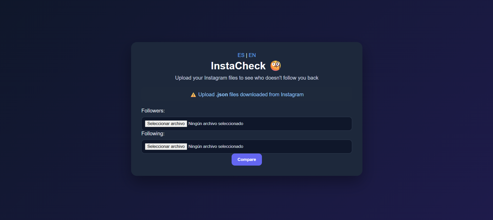
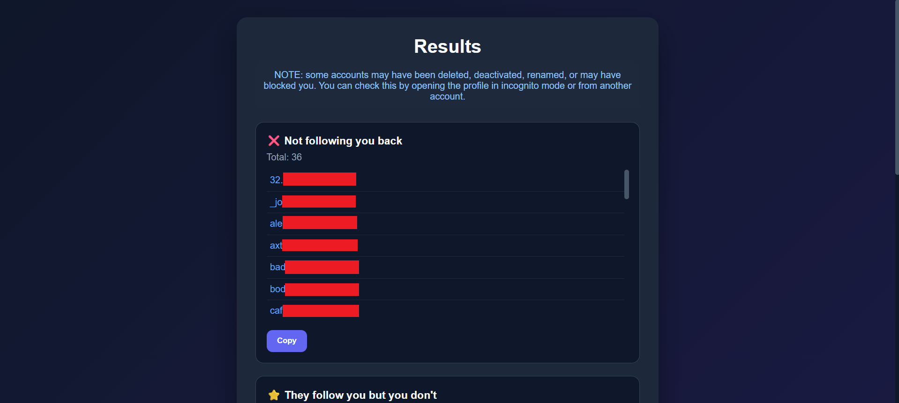

# InstaCheck

A web application built with Flask that allows users to analyze their Instagram followers and following lists.
The app processes JSON files downloaded from Instagram and shows who doesn't follow you back, who follows you, and mutual connections.

## What I learned

- Processing real-world JSON data
- Comparing datasets using Python (sets)
- Handling file uploads with Flask
- Improving user experience with validation and error handling
- Building a clean and simple UI
- Supporting multiple languages (Spanish / English)

## Features

- Upload Instagram followers and following JSON files
- Detect users who don't follow you back
- Detect users who follow you but you don't
- Show mutual connections
- Clickable usernames linking to Instagram profiles
- Copy results to clipboard
- Error handling for invalid files
- Bilingual interface (ES / EN)

## Technologies

- Python
- Flask
- HTML
- CSS
- JavaScript
- JSON

## How to run

1. Clone the repository:

git clone https://github.com/ferggz/InstaCheck.git

2. Go to the project folder:

cd instacheck

3. Run the app:

python app.py

4. Open in your browser

## How to get your Instagram data

1. Go to Instagram Settings
2. Request your data download
3. Select JSON format
4. Download and extract the files
5. Use:
   - followers_1.json
   - following.json

## Screenshots

### Home

### Results
